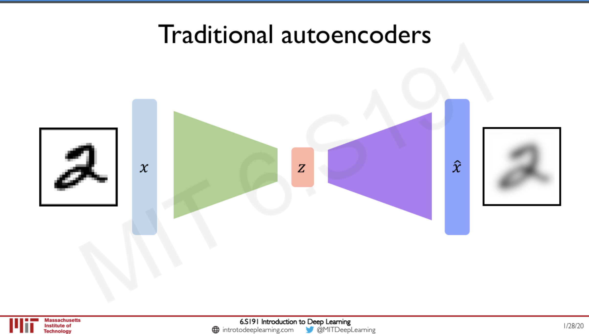
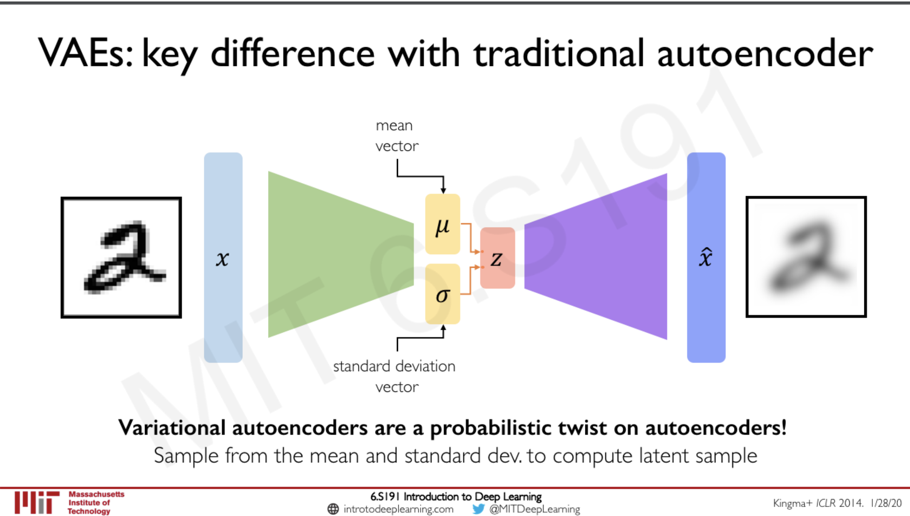

## Traditional and Variational Autoencoders

MIT provides a very good course on this subject: [video](https://youtu.be/rZufA635dq4) and [slides](http://introtodeeplearning.com/slides/6S191_MIT_DeepLearning_L4.pdf).

#### Traditional autoencoder

#### Variational autoencoder

